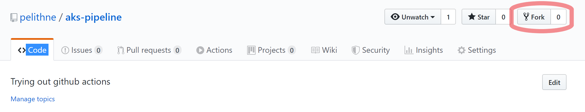
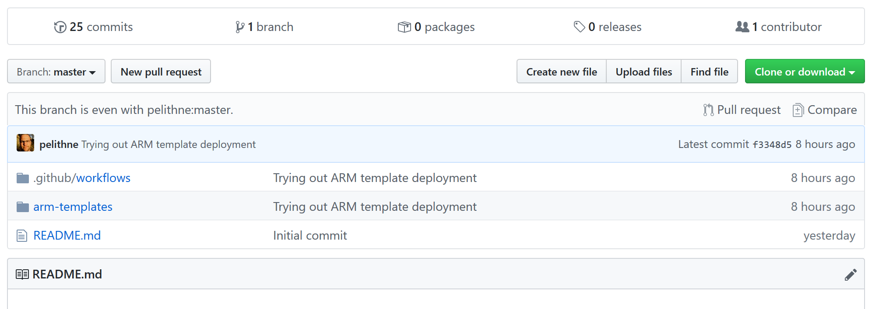
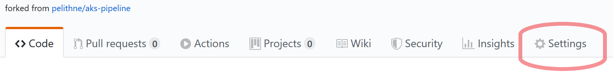
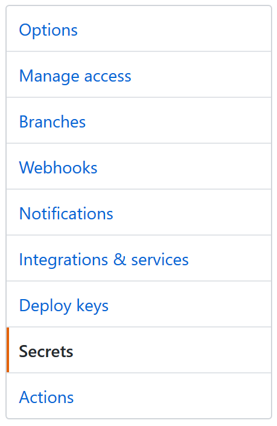
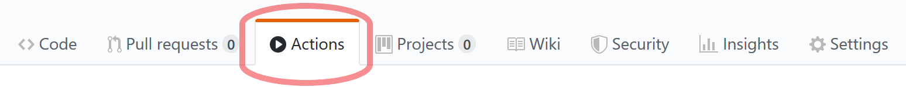
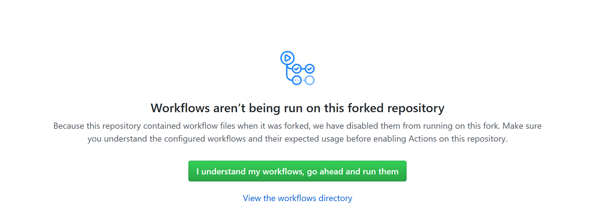
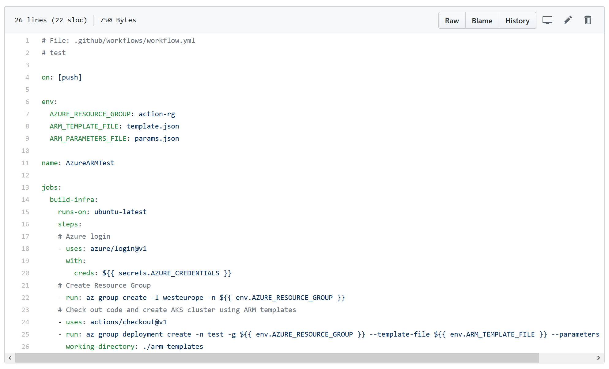
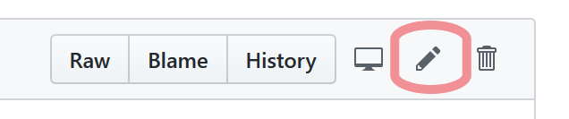

# Github Actions and Kubernetes on Azure

This tutorial explains how to set up a basic "infrastructure as code"-pipeline in Github to create a Kubernetes cluster in Azure using Azure Kubernetes Service, AKS.

## Azure subscription

To complete the tutorial, you need an Azure subscription. If you do not have one already, you can create a free 12-month subscription here: <https://azure.microsoft.com/free>

## Github account 

Also, you need a Github account. If you do not have one, create one for free here: <https://github.com/join>

At the end of the sign-up, you may be asked to create your first repository, but you don't have to that for now.

## Azure Portal

To make sure you are correctly setup with a working subscription, make sure you can log in to the Azure portal. Go to <https://portal.azure.com.

## Azure Cloud Shell

Azure Cloud Shell is a web based shell which has a lot of good tools pre-installed (like kubectl, az cli, helm, etc).

Start cloud shell by typing the address ````shell.azure.com```` into a web browser. If you have not used cloud shell before, you will be asked to create a storage location for cloud shell. Accept that and make sure that you run bash as your shell (not powershell).

**Protip: You can use ctrl-c to copy text in cloud shell. To paste you have to use shift-insert, or use the right mouse button -> paste. If you are on a Mac, you can use the "normal" Cmd+C/Cmd+V.**

**Protip II: Cloud Shell will time out after 20 minutes of inactivity. When you log back in, you will end up in your home directory, so be sure to ````cd```` into where you are supposed to be.**


## Create a service principal
You need to somehow allow Github to act on "your behalf" when deploying things in Azure. The way this is done, is by creating a **Service Principal**. 

The service principal is simply an identity. You can configure this identity to be allowed to do various things in your azure subscription. 

The easiest way to create a service principal is by using **azure cli**, a.k.a ````az`````. 

Lets use Azure CLoud shell to do this. In your cloud shell, do the following:

````bash
az ad sp create-for-rbac --sdk-auth --name actionsSP
````

Output from this command is a json object, and should look something like the below. You will need this output in a later step, so keep it available somehow.
````
{
  "clientId": "8e65cbad-bc58-4cc7-88f4-4eada9450c7d",
  "clientSecret": "869118ba-a0e1-4bd7-a746-fbeda735bdc6",
  "subscriptionId": "6f65205f-d352-482f-970b-a1d2a478fb64",
  "tenantId": "72f543bf-86f1-41af-91ab-2d7cd011db47",
  "activeDirectoryEndpointUrl": "https://login.microsoftonline.com",
  "resourceManagerEndpointUrl": "https://management.azure.com/",
  "activeDirectoryGraphResourceId": "https://graph.windows.net/",
  "sqlManagementEndpointUrl": "https://management.core.windows.net:8443/",
  "galleryEndpointUrl": "https://gallery.azure.com/",
  "managementEndpointUrl": "https://management.core.windows.net/"
}
````

For instance, copy this and paste it into a text editor.

## Fork Github pository

The easiest way to get the code for this tutorial, is by **forking** the Github repository where I put my code. Forking means that you copy the contents of my repository into a repository in your github account (it´s OK! This is open source after all :-)

To fork the repository, first navigate to <https://github.com/pelithne/aks-pipeline> then select the **fork** button in the top right corner. 

<p align="left">
  
</p>

You should now get a forked repository in your account, which looks similar to this:

<p align="left">
  
</p>

When you browse around the files, you will notice that the repository has some template files in the ```` 	arm-templates```` folder, and a pipeline definition in ````.github/workflows````. 

More on this later.

## Create the Service Principal Secret

As mentioned before, in order for Github actions to be able to interact with Azure, it needs an identity. For this you will use the service principal you created in a previous step.

In order for Github to be "made aware" of this identity, you will add it into the **secrets vault** in Github. 

To do this, first select **settings** to the right in your github toolbar.

<p align="left">
  
</p>
 
Then selclick on **secrets** in the left hand navigation bar

<p align="left">
  
</p>

After this, select **Add new secret** and paste in the json object you (hopefully saved before). 

Reminder, it should look similar to this:

````
{
  "clientId": "8e65cbad-bc58-4cc7-88f4-4eada9450c7d",
  "clientSecret": "869118ba-a0e1-4bd7-a746-fbeda735bdc6",
  "subscriptionId": "6f65205f-d352-482f-970b-a1d2a478fb64",
  "tenantId": "72f543bf-86f1-41af-91ab-2d7cd011db47",
  "activeDirectoryEndpointUrl": "https://login.microsoftonline.com",
  "resourceManagerEndpointUrl": "https://management.azure.com/",
  "activeDirectoryGraphResourceId": "https://graph.windows.net/",
  "sqlManagementEndpointUrl": "https://management.core.windows.net:8443/",
  "galleryEndpointUrl": "https://gallery.azure.com/",
  "managementEndpointUrl": "https://management.core.windows.net/"
}
````

The name of the secret should be **AZURE_CREDENTIALS**. (it could be anything, but the pipeline definition expects this name, so if you name it differently there will be some extra hacking).

Don't forget to click **Add Secret**

## Activate Actions
 
When you forked the repository, you also copied the pipeline. However, github will deactivate the pipeline on forked repos, so you need to activate it again. 

Do that by cliking on **actions** in the Github toolbar

<p align="left">
  
</p>

You will be asked to to activate workflows. Do that.

<p align="left">
  
</p>

After this, it's a bit unintuitive (at least for now), but to get to the pipeline definition you have to head back to the repository files, by selecting **code** in the Github toolbar, and then navigate to ````.github/workflows````.  

You should see something similar to this

<p align="left">
  
</p>

Now, in order for this pipeline to become active, you need to edit the file and make a new commit. To edit the file, select the pen icon to the left:


<p align="left">
  
</p>


After opening the file you could for instance you could add a comment on the second line after the hash-sign (````#````).

Then commit the change by clicking the **start commit** button

<p align="left">
  
</p>

Give the commit a *good* description and click on **Commit changes** to complete the commit.

This will "save" your change to the repository, and at the same time trigger off the pipeline that will build your AKS Kubernetes cluster.

## Actions

If all went well, a new workflow should have been triggered by yout commit. You can follow the progress of that workflow under that actions tab on the Github toolbar. 

The name of the worksflow should be "AzureARMTest" and there should be a "job" named "build-infra". If you click on "build-infra" you can monitor the progress of the job (or possibly identify errors that prevents the pipeline from finishing...).

Creating an AKS cluster takes a while, perhaps 7-8 minutes. After this you can go into the Azure portal and confirm that your cluster is up and running.